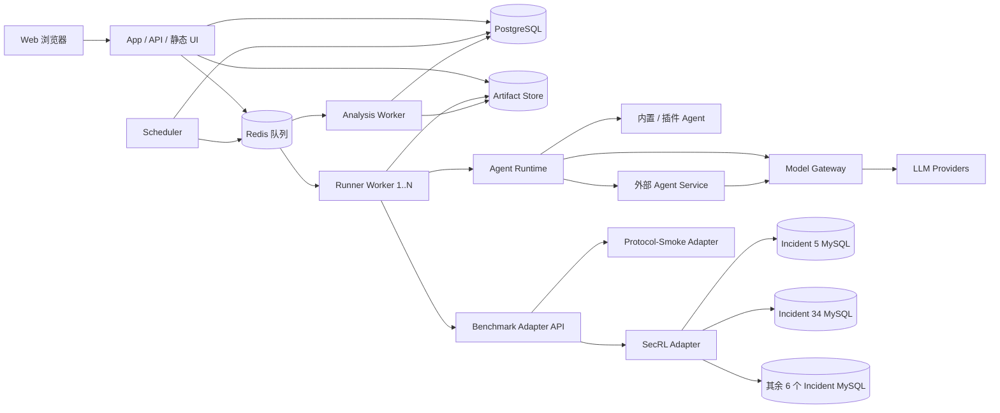
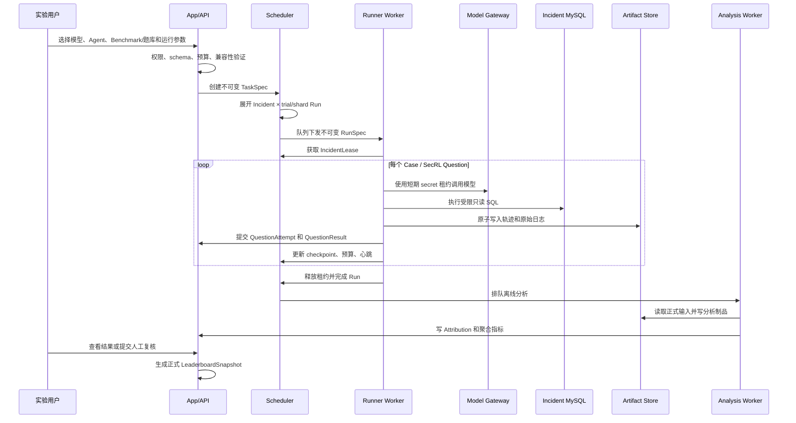
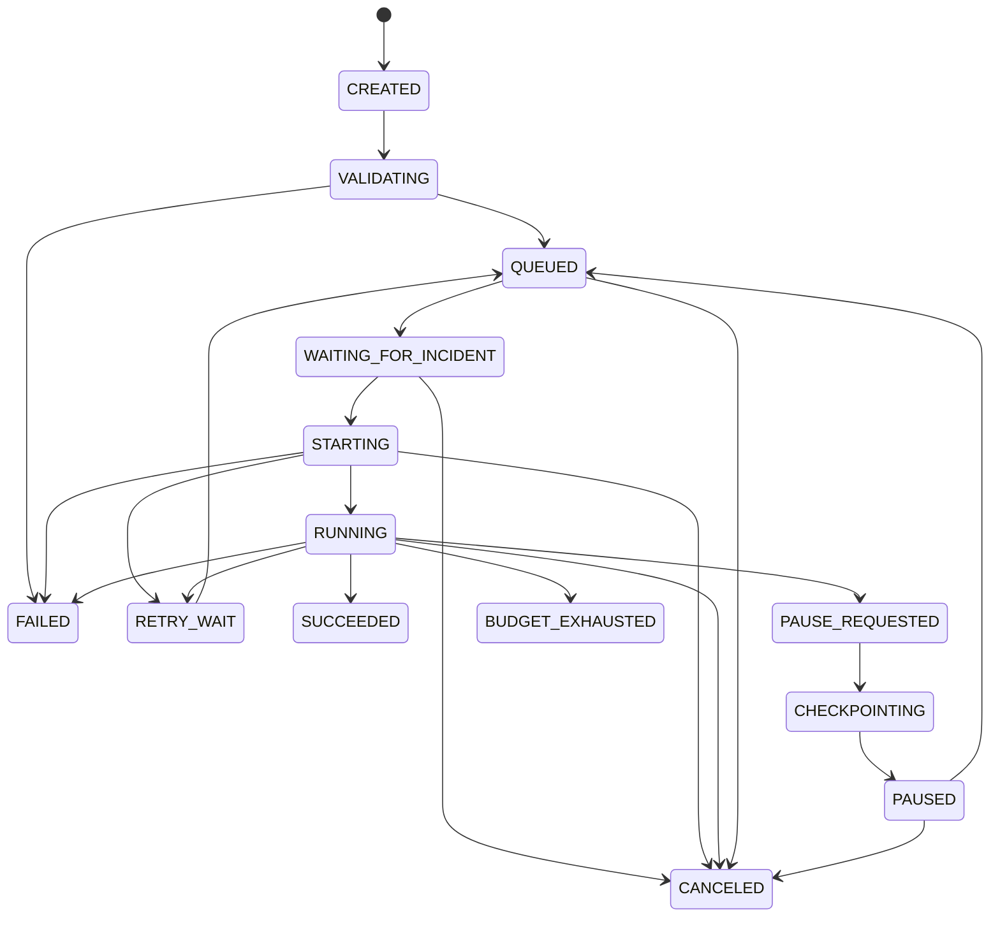

# SecRL / ExCyTIn-Bench Web 测评平台设计

**日期：** 2026-08-10

**状态：** 用户已批准，作为完整平台升级基线保留

**目标版本：** MVP 设计基线 v1

**适用范围：** SecRL / ExCyTIn-Bench 的产品化封装、Docker 部署、Web 管理、可审计测评与排行榜

## 1. 结论

将现有 Benchmark 封装为带 Web 管理页面、可通过 Docker Compose 部署的测评平台是可行的。

可行性判断为：

- 工程可行性：高。
- 产品化复杂度：中高。
- 核心算法不确定性：低；题库、实验逻辑和错因分析已有可复用实现。
- 最大风险：第三方智能体代码隔离、密钥泄露、实验语义漂移、Incident 数据库并发隔离、排行榜公平性。
- 推荐形态：**Docker Compose 部署的模块化单体**，通过 Benchmark Adapter 和 Agent Runtime 两套版本化协议避免绑定 SecRL，并保留未来拆成远程 Worker、对象存储、OIDC 和公网多租户架构的边界。
- MVP 部署目标：单台 Ubuntu 主机，支持 3–8 个跨 Incident 并行 Run；同一 Incident 同时只允许一个正式 Run 持有执行租约。
- 平台支持：Ubuntu/Linux `amd64` 与 `arm64` 作为生产目标；macOS 和 Windows Docker Desktop 作为本地开发、小规模测评目标。

本项目应拆分为多个有边界的子模块，但 MVP 不应拆成多个独立仓库或独立发布产品。推荐在一个仓库和一个发行版本中维护：

1. `platform`：Web UI、API、认证、领域逻辑和审计。
2. `runner`：任务 Worker、Agent 执行、环境适配和 Model Gateway。
3. `benchmark_adapters`：通用 Benchmark Adapter SDK、SecRL 适配器和协议兼容性 Benchmark。
4. `analysis`：现有离线错因分析、人工复核和聚合报告的任务封装。

## 2. 评估依据

### 2.1 已审查的现有实现

本设计基于对下列仓库内容和运行环境的审查，不是脱离代码的重新设计：

- `README.md`、依赖和安装配置。
- `experiments/run_exp.py`：实验入口、参数、Agent 构造、日志与断点续跑方式。
- `secgym/excytin_env.py`：Incident 映射、Docker/MySQL 生命周期、SQL 工具、轨迹与评测调用。
- `secgym/evaluator.py`：官方 reward 产生方式及 LLM evaluator 边界。
- `secgym/myconfig.py`：当前 LLM 配置和环境变量使用方式。
- `secgym/agents/agent.py` 及 `secgym/agents/` 下的 Baseline、ReAct、Reflexion、Prompt Sauce、Expel、MASET 等实现。
- Docker 与数据库初始化脚本，包括 Incident 数据导入、容器创建和数据卷处理。
- `secgym/questions/o1/test/` 的八个问题 JSON。
- `experiments/failure_analysis/`、`tests/failure_analysis/` 和已有无截断分析输出。
- 本机和 Ubuntu 远端仓库、Python、Docker、MySQL 镜像及现有 Incident 容器状态。

### 2.2 已确认的数据事实

Benchmark 当前包含 8 个 Incident、589 道题：

| Incident | 题量 |
|---|---:|
| `incident_5` | 98 |
| `incident_34` | 82 |
| `incident_38` | 11 |
| `incident_39` | 98 |
| `incident_55` | 100 |
| `incident_134` | 57 |
| `incident_166` | 87 |
| `incident_322` | 56 |
| 合计 | 589 |

问题对象字段一致，包括：

```text
context
question
answer
solution
start_alert
end_alert
start_entities
end_entities
shortest_alert_path
```

现有实验与分析产物体量已不适合全部写入关系数据库：本地实验日志约 879 MB，无截断结果约 52 MB，单条 observation 可接近 300 KB。因此平台采用“PostgreSQL 保存结构化索引和摘要，Artifact Store 保存不可变大对象”的分层存储。

### 2.3 当前代码的产品化缺口

`experiments/run_exp.py` 当前适合作为科研 CLI，不适合作为持久化任务编排器：

- Agent 名称到构造函数的映射硬编码在入口中。
- 执行记录主要依赖本地 JSON 文件和目录结构。
- `nodes` 被用于跳过已完成题目，但它不是足够稳定的题目版本标识。
- 实验按题顺序执行，缺少持久队列、租约、心跳和幂等提交。
- 重试主要针对 API 限流，不能区分题目失败、平台失败和 Worker 丢失。
- 模型供应商差异、上下文和参数能力散落在 Agent 代码与字符串判断中。

`secgym/excytin_env.py` 同时承担 Benchmark 语义、容器管理、数据库访问、工具执行、轨迹保存和 evaluator 调用，需由适配层保留行为，但拆开生命周期责任：

- 平台调度器管理 Incident 服务和租约。
- Runner 管理单题 Episode 和 Agent。
- SecRL Adapter 保留 SQL 工具与 observation 语义。
- Evaluator 作为版本化的独立步骤执行。

`secgym/agents/agent.py` 存在名义基类，但当前各 Agent 未形成统一契约：部分未继承基类，`reset` 参数不同，usage 数据结构也不同。平台首期不批量重写算法，而是通过兼容适配器统一接口。

`secgym/myconfig.py` 当前围绕单一环境变量和 `CONFIG_LIST` 组织，不具备多用户私有密钥、供应商适配、参数校验、费用版本和审计能力，应由平台 ModelConfig、SecretRef、Provider Adapter 和 Model Gateway 替代。

数据库脚本当前使用固定容器名和端口、root/admin 权限及可写数据挂载；这会引入冲突、越权和不可重复性，需重构部署责任与权限模型。

### 2.4 测试与环境结论

- 远端 Ubuntu 使用 Python 3.11.15 运行已部署的 failure analysis 测试集：73 个测试通过。
- 本机 Python 3.9 执行当前工作区可发现的 156 个测试时出现 11 个错误和 1 个失败，主要涉及 `Path.write_text(newline=...)` 的版本兼容及超大字段校验顺序。
- 这说明平台的 Python 基线应锁定在 3.11 或更高的已验证版本，不应以本机 3.9 行为作为生产基线。
- 远端主机为 `aarch64`，Docker Server 为 arm64；当前 `mysql:9.0` 镜像可运行在 arm64。
- 本地提交与远端提交不一致，远端分支领先且存在未提交改动。进入实现前必须先冻结并核对权威实验基线，避免把不同版本的运行语义混入平台。

## 3. 已确认的需求边界

### 3.1 MVP 信任模型

- 单组织、内部多用户。
- 内置用户名/密码认证，数据模型与 API 保留 OIDC 接入点。
- 角色分为管理员、实验用户、复核员和审计员。
- 模型 API Key 由各用户私有管理；管理员可以看到配置状态和掩码，但不能读取明文。
- 管理员可以安装经过审查的自定义 Agent 插件；普通用户只能配置已批准插件的 schema 参数。

### 3.2 运行边界

- MVP 单台 Ubuntu 主机。
- 目标并行度为 3–8 个实际 Run。
- 同一 Incident 只允许一个正式 Run 持有数据库执行租约。
- 暂停发生在当前题目完成后；恢复从下一道未完成题目开始。
- 单题内部不承诺任意 step 的进程级快照恢复。
- 失败重试创建新的 QuestionAttempt，不覆盖历史尝试。

### 3.3 正式与探索性实验

- 正式实验使用平台锁定的 evaluator 模型、prompt、参数和版本。
- 探索性实验可以选择 evaluator，但不自动进入正式排行榜。
- 正式排行榜只接受满足完整性和可重复性规则的提交。
- gold answer 和 solution 对普通实验用户在运行前隐藏。
- 人工复核采用单人可生效模式，但所有修订追加保存，自动候选归因不被覆盖。
- 正式排行榜 Run 的审计产物永久保留；探索性 Run 的保留期可配置。
- MVP 冻结 Benchmark Adapter v1 和 Agent Service Protocol v1，并使用极简非 SQL Benchmark 验证扩展协议，不在首期接入第二个正式 Benchmark。
- Agent Service 只返回结构化 Action；所有 Benchmark 工具都由平台执行。

## 4. 架构方案比较

### 4.1 方案 A：单容器

一个容器内运行 UI、API、任务执行、分析和数据库协调。

优点：

- 安装和演示最简单。
- 进程间调用少。
- 初始 Docker 配置工作量低。

缺点：

- Web 请求、长时间 LLM 调用和分析任务争用资源。
- 无法可靠处理 Worker 崩溃、重试、暂停和租约。
- 第三方 Agent 与管理服务处于同一信任边界。
- 扩容和故障定位困难。
- 不适合 3–8 个长任务并发。

结论：只适合一次性演示，不作为 MVP。

### 4.2 方案 B：Docker Compose 模块化单体

一个仓库和发行版本，按职责运行多个容器：App/API、Scheduler、Worker、Analysis Worker、PostgreSQL、Redis、Artifact Store 和八个 Incident MySQL 服务。

优点：

- 部署仍可保持 `docker compose up` 的体验。
- 队列、执行、分析和 Web 服务故障相互隔离。
- 能表达租约、心跳、幂等提交、暂停和失败重试。
- 可以在不改变领域 API 的前提下逐步迁移到远程 Worker 和对象存储。
- 适合当前单组织、单主机、3–8 并发范围。

缺点：

- 比单容器需要更多配置、健康检查和升级编排。
- 单主机仍是容量和可用性上限。
- Redis、PostgreSQL 和 Artifact Store 需要备份策略。

结论：**MVP 推荐方案**。

### 4.3 方案 C：前后端、API、Worker/Queue、DB 的独立多服务

各服务独立仓库、独立发布，可跨主机水平扩展。

优点：

- 适合公网、多租户、大规模 Worker 池和独立团队演进。
- 可实现更强的网络隔离、弹性和高可用。

缺点：

- 当前规模下会显著增加部署、版本协调、可观测性和运维成本。
- 需求仍以内部平台为主，提前拆分会降低迭代效率。
- 跨服务事务和审计一致性更复杂。

结论：作为第三阶段演进方向，不作为 MVP 起点。

## 5. 推荐部署拓扑



### 5.1 Compose 服务

| 服务 | 责任 | 是否接触用户 secret |
|---|---|---|
| `app` | UI、API、认证、配置、查询、审计入口 | 只处理加密写入和掩码状态 |
| `scheduler` | Task 展开、Run 排队、Incident 租约、预算与状态推进 | 否 |
| `worker` | Agent、Episode、SQL 工具、evaluator、checkpoint | 通过短期租约使用 |
| `agent-service-*` | 可选的外部语言/进程 Agent 实现，只返回结构化 Action | 只使用短期 Model Gateway capability token |
| `analysis-worker` | taxonomy、aggregate、review materialization | 否，除非未来启用 LLM 分析器 |
| `postgres` | 领域数据、状态、索引、审计事件 | 保存 secret 引用和密文，不保存日志明文 secret |
| `redis` | 短期队列、分布式信号、限流辅助 | 否 |
| `artifact-store` | 原始日志、轨迹、导出、manifest | 禁止保存未脱敏 secret |
| `incident-*` | 八个只读 Benchmark MySQL 服务 | 否 |

`app`、`worker` 和 `agent-service-*` 不挂载宿主 Docker Socket。Incident 服务由部署期 Compose 管理，运行期由 Scheduler 通过数据库健康状态和平台租约协调，而不是由 Agent 动态创建容器。Agent Service 不加入 Incident 数据库网络，也不能直接调用 Benchmark 工具。

### 5.2 公网演进

选择方案 B 不会阻断未来公网部署。为此 MVP 必须保留以下边界：

- 所有持久数据都带 `organization_id` 和所有者字段，即使 MVP 只启用一个组织。
- UI 只通过受版本控制的 API 访问数据。
- Worker 通过队列领取不可变 RunSpec，不依赖 App 进程内状态。
- Secret 使用抽象的 SecretProvider，MVP 可用应用层加密，后续可替换 Vault/KMS。
- ArtifactStore 使用接口抽象，MVP 可用本地内容寻址目录，后续可替换 S3 兼容对象存储。
- AuthProvider 保留 OIDC 接口。
- Agent 只通过能力接口访问模型和 SQL，不依赖宿主文件系统路径。

公网化仍需要第二、第三阶段增加 WAF、MFA、租户强隔离、配额、出站访问策略、强插件沙箱、高可用、灾备和合规治理，不能只把 MVP 端口暴露到互联网。

## 6. 跨平台支持

| 平台 | 支持级别 | 用途 | 约束 |
|---|---|---|---|
| Ubuntu/Linux `amd64` | 正式支持 | 生产与排行榜 | 推荐部署目标 |
| Ubuntu/Linux `arm64` | 正式支持 | 生产与排行榜 | 当前远端环境已验证 Docker/MySQL 基础能力 |
| macOS Intel | 本地支持 | 开发、小规模测评 | Docker Desktop，性能不作为正式排名依据 |
| macOS Apple Silicon | 本地支持 | 开发、小规模测评 | 优先使用多架构镜像，避免不必要模拟 |
| Windows x86_64 | 本地支持 | 开发、小规模测评 | Docker Desktop + WSL2，数据目录放在 Linux 文件系统 |
| 32 位 x86 | 不支持 | 无 | 依赖和镜像生态不匹配 |
| Windows 原生容器 | 不支持 | 无 | 平台统一使用 Linux 容器 |
| Windows ARM | 不作正式承诺 | 实验性 | 需单独验证依赖和镜像 |

正式排行榜中的耗时比较只允许在相同 ExecutionProfile、硬件类别和并发策略下进行。macOS 与 Windows 的本地运行结果可查看成功率和 reward，但默认不能与 Linux 生产环境进行正式耗时排名。

## 7. Agent 配置与插件体系

### 7.1 选择

采用 **代码插件 + manifest + 参数 JSON Schema** 的混合方式。

不选择纯 YAML/JSON 的原因：现有 Agent 包含循环、记忆、反思、多智能体协作和模型特定逻辑，纯声明式配置无法稳定表达核心行为。

不选择无元数据的纯代码插件原因：平台需要自动生成参数表单、校验兼容性、冻结版本、计算 hash、限制权限和进行审计。

### 7.2 统一运行契约

平台定义结构化 Protocol，不要求现有 Agent 立即继承同一基类：

```python
from typing import Protocol

class AgentProtocol(Protocol):
    @property
    def name(self) -> str: ...

    def reset(self, episode: "EpisodeContext") -> None: ...

    def act(self, observation: "Observation") -> "AgentAction": ...

    def usage(self) -> "UsageSnapshot": ...

    def close(self) -> None: ...


def create_agent(
    context: "AgentRuntimeContext",
    params: dict,
) -> AgentProtocol:
    ...
```

关键数据对象：

- `EpisodeContext`：稳定 QuestionRef、公开问题字段、执行限制、trial、seed 和能力句柄。
- `Observation`：结构化工具结果、step、截断信息和允许暴露给 Agent 的上下文。
- `AgentAction`：SQL、submit 或受注册表约束的其他动作，不接受任意 Python 调用。
- `UsageSnapshot`：按 provider/model/role 区分 prompt、completion、cached、reasoning token。
- `AgentRuntimeContext`：Model Gateway、logger、artifact writer、clock 和只读能力声明；不包含 API Key 明文和 Docker Socket。

现有 Agent 通过 adapter 映射不同的构造函数、`reset` 签名、action 字符串和 usage 结构。适配器经过回归测试后，逐个把实现内部迁移到新契约，而不是一次性重写所有算法。

### 7.3 Manifest

每个 AgentRevision 包含不可变 `agent.yaml`：

```yaml
manifest_version: "1"
agent_api_version: "1"
id: "secrl.react"
name: "SecRL ReAct"
version: "1.0.0"
entrypoint: "secrl_react.plugin:create_agent"
parameter_schema: "agent-params.schema.json"
supported_benchmarks:
  - "secrl.excytin"
model_roles:
  - "primary"
permissions:
  model_gateway: true
  sql_tool: true
  artifact_write: false
  outbound_network: false
assets:
  - path: "prompts/react_example_1.txt"
    sha256: "64位十六进制摘要"
```

manifest 还应记录：

- 包文件 SHA-256、manifest SHA-256 和 schema SHA-256。
- Python 与 Agent API 兼容范围。
- 锁定依赖清单和 SBOM hash。
- 支持的参数、默认值和 secret-free 配置。
- 所需模型能力，例如 tool call、JSON mode、上下文上限。
- 资源上限建议和兼容的 Benchmark Adapter 版本。

### 7.4 参数 JSON Schema

JSON Schema 驱动 Web 表单和服务端校验。普通用户只修改 schema 允许的字段，例如：

- system prompt 预设选择。
- memory 或 reflexion 开关。
- few-shot 资产选择。
- agent 内部迭代上限。
- 多智能体角色参数。

以下内容不允许通过参数表单注入：

- Python 模块或入口点。
- 任意文件路径。
- shell 命令。
- URL 形式的未批准依赖。
- API Key。
- Docker、数据库或宿主权限。

### 7.5 内置与自定义 Agent

内置 Agent：

- 源码进入官方 Runner 镜像。
- 与平台发行版本一起测试和签名。
- 通过 AgentRevision 记录代码提交、镜像摘要、manifest 和资产 hash。

管理员自定义 Agent：

- 上传 wheel、manifest、schema、依赖 lock、SBOM 和声明资产。
- 上传后进入隔离检查区，不直接出现在可运行注册表。
- 检查通过并由管理员明确批准后生成不可变 AgentRevision。
- 删除只撤销后续使用资格，不破坏历史 Run 的版本引用和 artifact。

### 7.6 上传与安全校验

检查流水线至少包括：

1. 压缩包大小、文件数、路径穿越和符号链接检查。
2. SHA-256 计算和不可变制品登记。
3. manifest 与 JSON Schema 校验。
4. 依赖 lock、许可证和已知漏洞扫描。
5. 禁止依赖和危险导入的静态检查。
6. 独立临时环境的 import 与契约 smoke test。
7. 使用假 Model Gateway 和假 SQL Tool 的单 Episode 测试。
8. 资源、超时、输出大小和日志 secret 扫描。
9. 管理员审批及 AuditEvent。

MVP 中每个自定义 AgentRevision 使用专用虚拟环境，并运行在非特权子进程中，设置 CPU、内存、进程数、文件大小和墙钟超时。插件只能调用注入的能力对象。

这不是对恶意 Python 的强安全沙箱。因此 MVP 仅允许受信管理员安装审查过的插件。面向公网前，插件应迁移到独立容器或远程沙箱，启用只读根文件系统、seccomp/AppArmor、网络出站白名单和更严格的资源隔离。

### 7.7 运行时加载

- 仅从已批准的 AgentRevision 注册表解析入口点。
- Worker 在领取 Run 前准备锁定环境，不在 Run 中执行在线 `pip install`。
- 禁止 `eval`、用户提供的任意 import path 和任意 git URL。
- RunSpec 固化 AgentRevision ID、所有 hash、参数规范化 JSON 和运行镜像 digest。
- 插件进程异常、超时或协议错误被记录为平台/Agent 失败，不伪装为 Benchmark 错答。

### 7.8 统一 Agent Runtime

平台上层只依赖 `AgentRuntime`，不区分实现来自内置 Python 类、管理员代码插件还是外部服务：

```text
AgentRuntime
├── InProcessAgentAdapter
├── PluginSubprocessAdapter
└── AgentServiceAdapter
```

三种实现接受相同的 SessionSpec、Observation、Action、UsageSnapshot 和错误模型。EvaluationTask、Run、结果页、审计和排行榜因此无需为服务型 Agent 建立旁路逻辑。

### 7.9 Agent Service Protocol v1

MVP 使用版本化 HTTP/JSON 协议。相较于 gRPC，它更便于 Python、Java、Go、Node 等实现接入、生成 OpenAPI 客户端、抓取审计证据和在 Docker Compose 中排障；协议规模不需要流式 RPC 的额外复杂度。

基础端点：

```text
GET  /v1/manifest
GET  /v1/health
POST /v1/sessions
POST /v1/sessions/{session_id}:act
GET  /v1/sessions/{session_id}/usage
POST /v1/sessions/{session_id}:close
```

`GET /v1/manifest` 返回：

- `protocol_versions` 和 Agent 实现版本。
- 参数 JSON Schema 及其 SHA-256。
- 支持的 action/observation content types。
- 支持的状态模式：stateless 或 stateful session。
- 最大并发、请求/响应大小和建议超时。
- Model Gateway 能力需求。
- 构建版本、镜像 digest 和健康信息。

创建 Session 时，平台只发送运行所需的公开信息：

```json
{
  "protocol_version": "1",
  "request_id": "019...",
  "session": {
    "run_id": "run_...",
    "case_ref": {
      "benchmark_revision": "benchrev_...",
      "dataset_version": "dataset_...",
      "case_id": "case_...",
      "case_hash": "sha256:..."
    },
    "public_input": {},
    "parameters": {},
    "limits": {
      "max_steps": 15,
      "deadline_ms": 30000
    },
    "capabilities": {
      "model_gateway": {
        "endpoint": "http://model-gateway.internal/v1",
        "token": "短期限定作用域令牌"
      }
    }
  }
}
```

平台调用 `:act` 时发送上一轮 Observation 和剩余限制：

```json
{
  "protocol_version": "1",
  "request_id": "019...",
  "sequence": 3,
  "observation": {
    "type": "tool_result",
    "content": {},
    "truncated": false
  },
  "limits": {
    "remaining_steps": 12,
    "deadline_ms": 30000
  }
}
```

Agent Service 只能返回符合当前 Benchmark Tool Schema 的结构化 Action：

```json
{
  "protocol_version": "1",
  "request_id": "019...",
  "sequence": 3,
  "action": {
    "type": "tool_call",
    "tool": "search",
    "arguments": {}
  },
  "usage": {}
}
```

响应中的 `usage` 是 Agent 自身计算与内部资源的补充声明；凡经平台 Model Gateway 发出的模型调用，以 Gateway 记录为 token/cost 权威来源，避免服务自行上报影响正式统计。

Action 联合类型至少包括：

- `tool_call`：请求平台执行注册工具。
- `submit`：提交最终答案。
- `yield`：有界等待，仅用于协议声明支持的异步 Agent。

Agent Service 不获得 gold、供应商 API Key、Docker Socket、宿主文件路径、Incident 数据库凭证或 Benchmark 网络访问。需要模型时，只能使用带 Run、AgentRevision、模型角色、额度和到期时间限制的短期 Model Gateway token。

### 7.10 幂等、错误与注册

- `request_id + sequence` 是 act 请求的幂等键；同一键重试必须返回相同 Action 或明确报告缓存已失效。
- 平台拒绝 sequence 回退、跳号、未知 tool、schema 不匹配和超限 payload。
- 标准错误码包括 `PROTOCOL_MISMATCH`、`INVALID_ACTION`、`SESSION_NOT_FOUND`、`DEADLINE_EXCEEDED`、`RATE_LIMITED`、`UNAVAILABLE` 和 `INTERNAL`。
- Agent Service 超时或不可用创建新的 QuestionAttempt；不把服务故障计为 Benchmark 错答。
- 服务由管理员登记固定 URL、TLS 身份、manifest hash 和允许网络范围；普通用户不能输入任意服务 URL。
- MVP 内部 Compose 网络可使用服务身份令牌；面向公网或跨主机前升级为 mTLS、服务签名和出站网关。
- 服务升级生成新的 AgentRevision；运行中的 Session 保持旧 revision，不热切换实现。

## 8. 模型、密钥与费用配置

### 8.1 ModelConfig

ModelConfig 由以下部分组成：

- 所有者和可见范围。
- Provider Adapter：OpenAI-compatible、Anthropic、Azure OpenAI/Foundry 等。
- base URL、model/deployment 名称和 API version。
- temperature、cache seed、上下文上限和输出上限。
- timeout、provider 并发、限流和重试策略。
- 支持能力：streaming、tool call、JSON、reasoning token、usage 字段。
- PricingProfileRevision。
- SecretRef，只显示状态、最近验证时间和掩码。

平台同时保存用户请求参数和 Provider 实际生效参数。供应商不支持的字段不得静默忽略，必须在验证阶段明确报错或按已记录的兼容策略转换。

### 8.2 Model Gateway

Agent 不直接得到供应商 SDK 配置或 API Key。所有模型调用经过 Model Gateway：

- 统一请求、重试、限流、usage 和错误分类。
- 注入关联 ID，记录 QuestionAttempt 与模型角色。
- 对 request/response 做大小限制和 secret 脱敏。
- 保存原始 provider usage 和规范化 usage。
- 根据 RunSpec 读取固定 Provider Adapter 版本。
- evaluator token 与 agent token 分开统计。

### 8.3 Secret 边界

- API Key 在服务端加密保存；MVP 主密钥通过部署 secret 注入，不进入镜像和数据库。
- Web API 永不返回 secret 明文。
- 只有持有短期执行租约的 Worker 能在内存中解密所需 secret。
- 日志、异常、artifact 和审计 payload 进入存储前执行 secret 扫描和脱敏。
- 管理员可以禁用、轮换或删除 SecretRef，但不能读取用户密钥。

### 8.4 费用

- PricingProfileRevision 按供应商、模型、计费单位、币种和生效时间版本化。
- Run 固化计算费用所用的价格版本。
- `estimated_cost` 使用冻结价格和规范化 token 计算。
- `billed_cost` 仅在供应商提供可核验账单数据时记录。
- 缺失 usage 或价格时显示“不可用”，不能按 0 参与成本排名。

## 9. Benchmark、题库与数据版本

### 9.1 通用发布模型

```text
Benchmark
  -> BenchmarkRevision
       -> DatasetVersion
            -> Scenario
                 -> Case
```

- `Benchmark` 是可编辑逻辑产品，例如 SecRL / ExCyTIn-Bench。
- `BenchmarkRevision` 固化 Benchmark Adapter、Tool Schema、Evaluation Protocol 和指标定义。
- `DatasetVersion` 是不可变数据发布，包含 split、Case、Scenario 资源和数据 manifest。
- `Scenario` 是需要共享环境或资源租约的通用分组；无共享环境的 Benchmark 可以只有一个默认 Scenario。
- `Case` 是平台调度和结果统计的最小问题单元，保存稳定 ID、版本内 index、canonical hash 和可见性受控输入。

SecRL 是该通用模型的一个映射：

- Incident 是 `Scenario` 的 SecRL 扩展。
- Question 是 `Case` 的 SecRL 扩展。
- MySQL 是 SecRL `EnvironmentProvider`。
- SQL query 和 submit 是 SecRL ToolDefinition。

因此平台核心、Agent Runtime、任务状态机和 artifact 模型不依赖 Incident、MySQL 或 SQL；这些概念只存在于 SecRL Adapter 及其领域扩展中。

### 9.2 Benchmark Adapter Protocol v1

Benchmark Adapter 是受信任的平台扩展，接口覆盖：

```python
class BenchmarkAdapterProtocol(Protocol):
    def manifest(self) -> "BenchmarkManifest": ...
    def validate_dataset(self, source: "DatasetSource") -> "ValidationReport": ...
    def import_dataset(self, source: "DatasetSource") -> "DatasetManifest": ...
    def enumerate_cases(self, dataset: "DatasetRef", scope: "Scope") -> list["CaseRef"]: ...
    def tool_definitions(self, revision: "BenchmarkRevisionRef") -> list["ToolDefinition"]: ...
    def prepare_scenario(self, scenario: "ScenarioRef") -> "EnvironmentLease": ...
    def start_episode(self, case: "CaseRef", lease: "EnvironmentLease") -> "Observation": ...
    def execute_action(self, episode: "EpisodeRef", action: "AgentAction") -> "Observation": ...
    def evaluate(self, episode: "EpisodeRef", submission: "Submission") -> "EvaluationResult": ...
    def normalize_metrics(self, episode: "EpisodeRef") -> "MetricSet": ...
    def close_episode(self, episode: "EpisodeRef") -> None: ...
    def release_scenario(self, lease: "EnvironmentLease") -> None: ...
```

BenchmarkManifest 至少声明：

- Adapter API 版本、实现版本和制品 hash。
- dataset/case/scenario JSON Schema。
- ToolDefinition 与 Action/Observation JSON Schema。
- 是否需要共享 Environment、租约策略和并发能力。
- evaluator 类型、reward 范围、success 判定和指标定义。
- gold 字段、可见性策略和 artifact 类型。
- checkpoint 粒度、超时、最大 payload 和清理语义。
- 正式排行榜资格规则和可比较维度。

Benchmark Adapter 比 Agent 拥有更高权限，因为它可以接触环境和 gold。MVP 只允许平台源码内置并随 Runner 镜像发布的受信 Adapter；管理员上传第三方 Benchmark Adapter 不属于 MVP。后续开放时必须使用独立环境服务、签名制品和比 Agent 更严格的安全审批。

### 9.3 Tool 执行边界

- Agent 只能从 BenchmarkManifest 获得公开 Tool Schema。
- Agent 的结构化 Action 由 Worker 校验后交给 Benchmark Adapter。
- Benchmark Adapter 或其 EnvironmentProvider 执行工具，并返回结构化 Observation。
- Agent 插件和 Agent Service 均不能直接连接 Benchmark 环境。
- gold 只在 evaluator capability 中可见，不进入 Agent SessionSpec、Observation 或 Model Gateway 请求。
- Action、Observation、schema version、截断和 artifact 引用全部进入轨迹。

这条边界同时适用于 SecRL SQL、未来的代码执行、浏览器、文件分析或其他工具型 Benchmark。

### 9.4 Protocol-Smoke Benchmark

MVP 内置一个极简非 SQL 的 `Protocol-Smoke Benchmark`，用于证明平台没有被 SecRL 特化。它不作为正式业务 Benchmark，也不进入正式业务排行榜。

定义：

- 使用随代码发布的本地 JSON 小语料，不依赖 MySQL、额外 Docker 环境或外部 API。
- 包含 12–20 个确定性 Case。
- 提供 `search`、`read` 和 `submit` 三个结构化 Tool。
- 使用确定性 exact/normalized evaluator，不消耗 evaluator LLM token。
- 一个默认 Scenario，无共享可变状态，允许并发执行。

测试覆盖：

- Dataset 导入、schema、canonical hash 和版本冻结。
- 单步、多步和错误 Tool 参数。
- 长 Observation、截断和 artifact 引用。
- 非法 Action、未知 Tool、max_steps 和错误答案。
- 题目边界暂停/恢复和 QuestionAttempt 重试。
- 内置 Agent、代码插件适配器和 Agent Service 的相同交互结果。
- reward、token、cost、轨迹、审计和排行榜 Benchmark 隔离。

该 Benchmark 是协议一致性夹具，不承诺代表真实 Agent 能力；它的价值是让 CI 能在无 Docker MySQL、无 API Key 的条件下验证通用运行链路。

### 9.5 SecRL 导入流程

1. 导入到 Draft DatasetVersion。
2. 验证八个 Incident、题量、JSON schema、index、必填字段和编码。
3. 将 Incident/Question 映射为 Scenario/Case，并保存 SecRL 扩展字段。
4. 计算每题完整 canonical JSON SHA-256 和问题文本 SHA-256。
5. 校验重复题、重复 index、Incident 映射和 start/end 实体字段。
6. 关联 SQL、schema、`data_anonymized` 树 hash 和 MySQL 镜像 digest。
7. 生成差异报告、内容 manifest 和总 SHA-256。
8. 管理员发布后版本冻结；任何修正创建新 DatasetVersion，并指向父版本。

现有 `nodes` 仅作为诊断和筛选字段，不作为唯一题目身份。正式身份由 BenchmarkRevision、DatasetVersion、Scenario/Incident、Case/Question index 和 canonical hash 共同确定。

### 9.6 Gold 数据

- `answer` 和 `solution` 被标记为 gold 受限字段。
- 普通实验用户在运行前和 Agent 执行过程中不可访问。
- evaluator 进程按能力令牌读取。
- 运行完成后的展示权限由 Benchmark 发布策略控制；默认实验用户只看自己的 submitted answer、reward 和允许公开的解释。
- 管理员、授权复核员和审计员的读取进入审计日志。

### 9.7 导出与完整性

导出包包含：

- BenchmarkRevision 和 DatasetVersion manifest。
- Case/Question JSON 或授权后的脱敏版本。
- Scenario/Incident 环境、schema、SQL 和数据 manifest。
- ToolDefinition、Evaluation Protocol 和指标定义 hash。
- `SHA256SUMS`。
- 导出工具版本、导出人、时间和 AuditEvent ID。

平台导入和导出均使用结构化 JSON/YAML 解析器，不用字符串拼接修改 schema。

## 10. Incident MySQL 部署与隔离

### 10.1 方案评估

| 方式 | 优点 | 风险 | 决策 |
|---|---|---|---|
| 挂载宿主 Docker Socket | 可按 Run 动态建库 | 等同高权限宿主控制，插件逃逸影响大 | MVP 禁止 |
| Docker-in-Docker/sidecar daemon | 与宿主 daemon 分开 | 存储、网络、嵌套权限和故障恢复复杂 | 不采用 |
| Compose 固定八个 MySQL 服务 | 简单、可审计、可健康检查、无 socket | 同一 Incident 并发需串行租约 | MVP 推荐 |
| 预建数据库镜像/快照 | 启动快、内容易固定 | 镜像较大、数据许可和多架构发布复杂 | 第二阶段加速项 |

### 10.2 MVP 数据准备

- 宿主提供已授权的 `data_anonymized`，以只读方式挂载到初始化容器。
- 初始化前计算文件树 SHA-256、大小、文件数和权限检查。
- 使用版本化 SQL 和固定字符集、时区、排序规则进行确定性导入。
- 导入到每个 Incident 独立的 named volume。
- 导入成功后保存 schema hash、row-count 摘要、SQL hash、数据树 hash 和 MySQL image digest。
- 运行期 MySQL 不再依赖可写宿主数据目录。

第二阶段可以从同一 manifest 生成预建数据库镜像或卷快照，加快冷启动；快照必须保持 `amd64`/`arm64` 可用性和数据分发许可。

### 10.3 权限与网络

- Incident MySQL 不映射宿主端口，只加入受控 Compose 内网。
- root 凭证随机生成，仅初始化和运维使用。
- Runner 使用非 root Benchmark 只读账号。
- 数据库权限、服务端只读设置和 Action Validator 三层限制写操作。
- 允许的动作限于 `SELECT`、只读 CTE、`SHOW` 和 `DESCRIBE` 等 Benchmark 必需语句。
- 拒绝 DML、DDL、文件读写、管理命令和多语句执行。
- 每条 SQL 设置 30 秒执行上限，并限制结果行数、单元格长度和返回总大小。
- 容器配置健康检查、CPU/内存限制、非特权模式和固定镜像 digest。

### 10.4 并发租约

每个 Incident 对应一个 durable IncidentLease：

- Scheduler 通过 PostgreSQL 事务获得租约。
- 租约记录 owner Run、worker、epoch、开始时间、到期时间和 heartbeat。
- 正式 Run 同一 Incident 同时最多一个。
- Worker 丢失后，必须等待租约过期或由安全回收流程确认后再发放新 epoch。
- 旧 Worker 的结果提交因 epoch 不匹配而被拒绝，防止双写。
- 不同 Incident 可以并行，因此最多可自然形成八路数据库并发。

每个 Run 固化：DatasetVersion hash、Incident data hash、SQL hash、schema hash、MySQL digest、ExecutionProfile 和租约历史。

## 11. 领域模型与数据表草图

### 11.1 身份与配置

| 表 | 关键字段 | 说明 |
|---|---|---|
| `User` | id, organization_id, role, status, password_hash | 内置认证用户，OIDC subject 可后加 |
| `SecretRef` | id, owner_id, provider, ciphertext, key_version, status | 私有密钥，只返回掩码状态 |
| `ModelConfig` | id, owner_id, name, current_revision_id | 可编辑逻辑身份 |
| `ModelConfigRevision` | provider, endpoint, model, params_json, secret_ref_id, adapter_version, hash | 不可变运行配置 |
| `PricingProfileRevision` | model key, currency, rates, source, effective_at, hash | 费用复现依据 |
| `EvaluatorProfile` | id, current_revision_id, official | evaluator 逻辑身份 |
| `EvaluatorProfileRevision` | model revision, prompt hash, params, parser version, hash | 正式或探索性 evaluator |

### 11.2 Benchmark 与 Agent

| 表 | 关键字段 | 说明 |
|---|---|---|
| `Benchmark` | id, slug, name, owner, status | Benchmark 大类 |
| `BenchmarkRevision` | id, benchmark_id, adapter_revision_id, tool_schema_hash, evaluation_protocol_hash | 通用 Benchmark 行为版本 |
| `BenchmarkAdapterRevision` | id, api_version, entrypoint, manifest, artifact_hash, image_digest | 受信 Adapter 实现 |
| `DatasetVersion` | id, benchmark_revision_id, version, parent_id, split, manifest_hash, status | 发布后不可变 |
| `Scenario` | id, dataset_version_id, key, type, environment_manifest_hash | 通用环境/资源分组 |
| `Case` | id, scenario_id, index, case_hash, public_input, gold_ref | 通用最小测评单元 |
| `Incident` | id, scenario_id, code, data_manifest_hash, schema_hash | SecRL Scenario 扩展 |
| `Question` | id, case_id, question_hash, text_hash, metadata_json | SecRL Case 扩展，gold 由 Case 引用 |
| `AgentDefinition` | id, slug, name, owner, current_revision_id | Agent 逻辑身份 |
| `AgentRevision` | id, definition_id, version, runtime_type, endpoint/entrypoint, manifest, schema, artifact_hash, approval | 内置、插件或服务的不可变版本 |
| `ExecutionProfile` | id, OS/arch, image digests, limits, concurrency, hash | 可比性和复现依据 |

### 11.3 任务与结果

| 表 | 关键字段 | 说明 |
|---|---|---|
| `EvaluationTask` | id, creator, task_spec_hash, formal_flag, status, budget | 用户提交的一组实验 |
| `Run` | id, task_id, scenario_id, trial, shard, run_spec_hash, status, lease_epoch | 调度和恢复单位；SecRL 可关联 Incident |
| `QuestionResult` | id, run_id, case_id, question_id, final_attempt_id, reward, status, metrics | 一题最终视图；通用 Case 必填 |
| `QuestionAttempt` | id, result_id, attempt_no, reason, status, started_at, ended_at | 追加式尝试历史 |
| `Trajectory` | id, attempt_id, artifact_id, sha256, bytes, step_count | 大对象引用 |
| `TrajectoryStepIndex` | trajectory_id, step, action_type, sql_status, offsets, excerpt | 可查询索引，不复制完整轨迹 |
| `Attribution` | id, result_id, analyzer_revision, candidate, confidence, evidence_artifact | 自动错因候选 |
| `HumanReview` | id, attribution_id, revision_no, reviewer, decision, note, prior_review_id | 追加式人工复核 |
| `LeaderboardSnapshot` | id, rule_version, dataset_version, created_at, manifest_hash | 不可变榜单快照 |
| `LeaderboardEntry` | snapshot_id, submission_task_id, metrics, rank, eligibility | 快照内条目 |
| `Artifact` | id, kind, storage_key, sha256, size, mime, retention, encryption | 内容寻址制品元数据 |
| `AuditEvent` | id, actor, action, subject, payload_hash, prev_hash, event_hash, timestamp | 追加式审计链 |

### 11.4 不可变原则

- 可编辑的逻辑对象指向不可变 revision。
- Task 创建时解析并固化所有 revision、参数和 hash。
- Run 不跟随后续 ModelConfig、AgentDefinition、BenchmarkRevision 或 DatasetVersion 修改。
- retry 追加 QuestionAttempt，不覆盖原始日志和指标。
- HumanReview 追加修订，不覆盖 Attribution candidate。
- LeaderboardSnapshot 永不原地重算；新规则生成新快照。

## 12. 完整数据流



### 12.1 Task 展开

EvaluationTask 保存用户选择和规范化后的 TaskSpec。Scheduler 以确定性顺序展开：

```text
selected scenarios × trial indexes × optional shards
```

每个 Run 处理一个 Scenario 的有序 Case 集。SecRL 中 Scenario 即 Incident；MVP 默认不把同一 Incident 的题分发给多个并行 Worker，以保持数据库隔离、缓存语义和恢复简单。Protocol-Smoke 的默认 Scenario 无共享可变状态，可以按 ExecutionProfile 并发。

### 12.2 单 Case 提交

单个 Case（SecRL 中为 Question）采用以下原子边界：

1. 轨迹、原始响应和日志先写临时 artifact。
2. 完成 hash、大小和 secret 扫描。
3. Artifact Store 原子提交或内容寻址 rename。
4. PostgreSQL 事务写入 Artifact、QuestionAttempt、QuestionResult 和 checkpoint。
5. 事务提交后才推进下一题。

Worker 在步骤 3 与 4 之间崩溃时，未引用 artifact 由回收任务处理；不会把半成品标为成功。

## 13. 任务状态机



状态含义：

- `CREATED`：Task/Run 记录已创建。
- `VALIDATING`：解析 revision、权限、数据完整性、模型能力和预算。
- `QUEUED`：等待 Worker。
- `WAITING_FOR_INCIDENT`：已分配 Worker，但目标 Incident 租约被占用。
- `STARTING`：准备 Agent 环境、secret lease、DB 健康和 artifact session。
- `RUNNING`：执行题目。
- `PAUSE_REQUESTED`：用户请求暂停，当前题继续。
- `CHECKPOINTING`：当前题落盘并释放资源。
- `PAUSED`：可从下一题恢复。
- `RETRY_WAIT`：平台级可重试错误等待退避。
- `SUCCEEDED`：范围内所有题均产生有效最终结果和完整 artifact。
- `BUDGET_EXHAUSTED`：预算门限触发的终态。
- `FAILED`：永久验证错误或重试耗尽。
- `CANCELED`：用户或管理员取消。

AnalysisJob 使用独立状态机；分析失败不把已完成 Run 改为失败。界面同时展示“实验完成，分析失败/等待重试”。

## 14. 错误分类与重试

| 错误 | 例子 | 处理 |
|---|---|---|
| Benchmark 行为结果 | SQL 语法错、空结果、错误答案、达到 max_steps | 不做平台重试，计入轨迹与错因分析 |
| Provider 瞬时错误 | 429、5xx、短时网络错误 | 有界指数退避，遵守 Retry-After 和预算 |
| Provider 永久错误 | 401、模型不存在、参数不支持 | 立即失败，标记配置/权限原因 |
| Worker 丢失 | 心跳过期、进程退出 | 回收租约，从最后完整题开始，新建 attempt |
| Incident 暂时不可用 | 健康检查失败、连接重置 | 隔离服务、恢复后重排队；不覆盖已完成题 |
| Agent 协议错误 | 非法 action、输出解析失败、子进程超时 | 按策略有限重启；保留原 attempt |
| Artifact 错误 | hash 不符、写入不完整、secret 扫描失败 | 阻止成功提交，进入平台重试或人工处置 |
| 分析错误 | 输入缺失、taxonomy 版本问题 | Run 保持完成，AnalysisJob 独立重试 |

所有自动重试记录 `reason_code`、原错误摘要、重试策略版本和前一 attempt。用户手动重试也创建新记录并进入 AuditEvent。

## 15. 结果、轨迹与错因分析

### 15.1 结果指标

平台核心只规定跨 Benchmark 都能解释的 envelope；BenchmarkRevision 通过 MetricDefinition 注册领域指标。每个指标包含名称、类型、单位、聚合方式、缺失值规则和是否允许排名。SecRL 的 SQL 指标位于 `secrl.*` namespace，不能被其他 Benchmark 误解为通用字段。

- `reward`：官方 evaluator 给出的不可变原始值。
- `success`：MVP 正式规则为 `reward == 1`。
- `success_rate`：成功题数 / 计划题数；不把缺失题排除分母。
- `average_reward`：按题等权平均，不能按 Incident 等权替代。
- `steps`：与现有环境一致，包含 submit step。
- `secrl.sql_success/secrl.sql_failure`：SecRL 非 submit SQL 的执行成功/失败计数。
- token：Agent 与 evaluator 分开，保留 provider 原始 usage。
- cost：estimated 与 billed 分开，缺失值不置零。
- duration：排队、等待 Incident、模型、SQL、分析和总墙钟时间分开。

### 15.2 轨迹存储

- 完整轨迹、模型原始响应和大 observation 存入 Artifact Store。
- PostgreSQL 只保存 step 索引、action 类型、SQL 状态、长度、offset 和安全 excerpt。
- artifact 使用 SHA-256 内容寻址、原子写入、MIME/编码记录和可验证下载。
- UI 默认懒加载和虚拟滚动，不把整份数百 MB 日志装入浏览器。

### 15.3 failure_analysis 复用

现有 `experiments/failure_analysis/` 作为版本化离线分析核心直接复用：

- identity mapping 和 canonical fingerprint。
- deterministic feature extraction。
- `taxonomy_v1` attribution。
- SQL retrieval subtype overlay。
- JSONL/CSV/Markdown/reporting 和 manifest。
- human review candidate、复核输入和 aggregate。

平台新增的是 adapter 和 orchestration：

- 从 Run/Artifact 物化分析工具所需的只读输入。
- 记录 AnalyzerRevision、taxonomy hash、CLI 参数和输入 hash。
- 把输出 artifact 登记到数据库，并建立 Attribution 索引。
- 保持自动候选和人工确认分离。

不在 MVP 中重写现有归因算法，也不让 LLM 自动覆盖人工结论。

## 16. 人工复核

复核页面采用题目、gold/evidence、轨迹和候选归因的并列视图。复核员可：

- 确认或修改 primary cause。
- 选择多个 secondary causes。
- 调整置信度等级。
- 引用 trajectory step、SQL、observation 或 evaluator 字段作为 evidence。
- 添加复核说明。
- 将问题标记为 gold/evaluator/infra 复查。

单名授权复核员可以提交生效决定。每次修改生成新的 HumanReview revision，并通过 `prior_review_id` 串联；旧结论、自动 candidate 和证据均不可覆盖删除。

聚合报表明确区分：

- 自动候选。
- 当前生效人工复核。
- 历史人工复核。
- 未复核或冲突状态。

## 17. 排行榜规则

排行榜的首要分区键是 `BenchmarkRevision + DatasetVersion + EvaluationProtocolRevision + RuleVersion`。不同 Benchmark 的 reward、success 和工具成本语义不同，平台不提供跨 Benchmark 的默认总榜，也不把 Protocol-Smoke 结果与正式业务 Benchmark 混排。

### 17.1 正式提交资格

正式排行榜的最小提交单位是一项预先声明且完整完成的 EvaluationTask，而不是从多次试验中挑选最佳单 Run。

正式默认榜要求：

- 指定官方 DatasetVersion 的 `test` split。
- 指定冻结的 BenchmarkRevision、Tool Schema 和 Evaluation Protocol。
- 完整覆盖 589 题和 8 个 Incident。
- 使用固定 EvaluatorProfileRevision。
- 使用获批 AgentRevision、固定 ModelConfigRevision 和 Provider Adapter 版本。
- 使用官方 ExecutionProfile、trial、cache 和 retry policy。
- 题目、数据、SQL、镜像、代码、manifest 和 artifact hash 完整。
- 没有缺题、人工删除结果或超出规则的选择性重试。

Incident 子榜从合格的全量提交中切片计算。只运行单个 Incident 的任务属于探索性比较，不自动进入正式 Incident 子榜。

### 17.2 默认准确性排名

排序键依次为：

1. `success_rate` 降序。
2. `average_reward` 降序。
3. `agent_tokens_per_question` 升序。

三项完全相同则为并列名次，使用 dense rank。Submission ID 只用于界面稳定排序，不影响名次。

### 17.3 效率视图

- Token 榜按 agent token、总 token 和每成功题 token 分开展示。
- Cost 榜仅纳入 PricingProfileRevision、币种和 usage 可核验的提交。
- Runtime 榜仅比较相同 ExecutionProfile、硬件类别、Incident 数据形态和并发策略的提交。
- 未知 cost、token 或 duration 不按零值获得优势。

### 17.4 快照与替换

- 完成任务不会自动公开；用户必须明确“提交到排行榜”。
- 资格检查通过后进入下一个 LeaderboardSnapshot。
- 同一提交者可以指定新提交替换“当前展示”条目，但历史快照永久保留。
- Snapshot 固化规则版本、纳入的 Submission、全部指标、资格理由和 aggregate manifest SHA-256。

## 18. 审计、权限与保留

### 18.1 角色

| 角色 | 主要权限 |
|---|---|
| 管理员 | 用户、Dataset 发布、插件审批、系统配置、Incident 运维 |
| 实验用户 | 管理自己的模型 secret、创建任务、查看授权结果、提交排行榜 |
| 复核员 | 读取授权 gold/evidence、提交追加式 HumanReview |
| 审计员 | 只读访问版本、hash、AuditEvent、manifest 和快照 |

管理员没有读取用户 secret 明文的 API。数据库运维访问和应用管理员权限分离记录。

### 18.2 审计链

AuditEvent 至少覆盖：

- 登录、认证失败、角色和权限修改。
- Secret 创建、验证、轮换、禁用和删除。
- Model/Agent/Dataset revision 发布或撤销。
- Task 创建、暂停、恢复、取消和手动重试。
- gold、artifact 和原始日志的受限读取。
- HumanReview 提交和修订。
- 排行榜提交、资格判断和快照生成。

每条事件包含 actor、action、subject、规范化 payload hash、前一事件 hash 和本事件 hash。平台周期性生成签名 SHA manifest，覆盖数据库导出摘要和 Artifact 清单。

### 18.3 保留策略

- 正式排行榜相关 Task、Run、QuestionResult、轨迹、分析、复核、AuditEvent 和 manifest 永久保留。
- 探索性 Run 默认保留期由管理员配置；删除采用先标记、宽限期、后清理 artifact 的流程。
- 被删除探索 artifact 的元数据、hash、删除授权和审计事件继续保留。
- Secret 删除后只保留不可逆标识、状态和审计记录。

## 19. 页面信息架构

平台第一屏是可工作的 Dashboard，不建设营销 landing page。整体采用安静、信息密集的运维控制台布局，桌面优先并支持平板宽度。

### 19.1 导航

```text
Dashboard
Models
Agents
Benchmarks
Tasks
Runs
Reviews
Leaderboard
Artifacts
Audit
Administration
```

### 19.2 核心页面

**Dashboard**

- 正在运行、排队、等待 Incident 和需要处理的任务。
- 当日 token/cost、成功率趋势和资源状态。
- Provider、Worker、Redis、PostgreSQL 和八个 Incident 的健康状态。
- 复核队列、失败分析和预算告警。

**模型**

- ModelConfig 列表、所有者、供应商、模型、验证状态和 secret 掩码。
- 创建/修订表单：base URL、model、temperature、cache seed、上下文、限流、重试、PricingProfile。
- 测试连接只返回能力与状态，不回显 secret。

**智能体**

- AgentDefinition 和不可变 revisions。
- runtime type、manifest、参数 schema、兼容 Benchmark、资产 hash、服务健康、审批和撤销状态。
- 普通用户看到 schema 驱动参数表单；管理员看到插件上传、检查报告和审批。
- 管理员可登记固定 Agent Service endpoint，查看协议协商、TLS/身份、并发和健康检查；普通用户不能填写任意 URL。

**题库**

- BenchmarkRevision、Adapter/Tool/Evaluation Protocol 版本、DatasetVersion、split、Scenario 和 Case 完整性。
- SecRL 视图展示八个 Incident 和 589 道 Question；Protocol-Smoke 作为系统兼容性数据集单独标识。
- Question 筛选、元数据、hash 和版本差异。
- gold/solution 按权限隐藏。
- Draft 导入、校验报告、发布、导出和 SHA manifest。

**任务创建**

四步向导：

1. 范围：Benchmark、DatasetVersion、split、Incident、题目 index/filter。
2. 运行：Model revision、Agent revision/参数、evaluator、max_steps、max_str_len、max_entry_return。
3. 可靠性：并发、试次数、cache、retry、timeout、暂停策略。
4. 预算与资格：token/cost 上限、正式/探索性、排行榜资格预检和最终摘要。

**任务与运行列表**

- 状态、进度、Incident、Worker、试次、预算、耗时和错误筛选。
- 批量暂停、恢复、取消只对有权限且满足状态规则的项目启用。

**运行详情**

Tabs：Overview、Questions、Trajectories、Analysis、Artifacts、Audit。

- 总进度、当前题、租约、预算和分阶段耗时。
- 题级 reward、submitted answer、token、cost、SQL、steps、attempt。
- 日志流使用分页和增量更新，不一次加载全部内容。

**结果详情**

- Question、可见上下文、submitted answer、reward 和 evaluator 结果。
- 按 step 查看 action、SQL、observation、截断状态和 token。
- attempt 切换和差异比较。
- Attribution primary/secondary、置信度和 evidence。

**错因复核**

- 左侧队列与过滤；中间题目/轨迹/evidence；右侧复核表单和历史。
- 支持键盘导航、保存草稿、提交 revision 和冲突提示。
- 不允许通过编辑复核结果改变官方 reward。

**排行榜**

- DatasetVersion、Incident、模型、Agent、规则版本和快照筛选。
- 准确性、token、cost、耗时视图。
- 展示资格、hash、ExecutionProfile、缺失指标和可重复性信息。
- 正式与探索性结果在导航和视觉上明确分开。

**Artifacts / Audit / Administration**

- Artifact hash 验证、授权下载、保留策略和引用关系。
- AuditEvent 查询、链验证和 manifest 导出。
- 用户角色、插件审批、Agent Service 注册表、系统健康、备份和 Incident 数据状态。

## 20. 现有代码的复用与适配

### 20.1 直接复用

- 八个 Incident 的 589 道问题数据，导入为首个 DatasetVersion。
- `experiments/failure_analysis/` 的 identity、feature、taxonomy、reporting、review 和 aggregate 核心。
- 现有多模型、多 Agent 结果与无截断结果，作为迁移、回归和 UI 大数据样例。
- Agent 的核心算法、prompt 和经验资产，在 adapter 保护下复用。

### 20.2 需要适配

- `experiments/run_exp.py`：提取为 Runner orchestration 和 SecRL adapter，不继续作为 Web 后台长任务进程。
- `secgym/excytin_env.py`：保留 observation、SQL 工具、step 和 submit 语义，移除运行期 Docker 生命周期责任。
- `secgym/evaluator.py`：包装为 EvaluatorProfileRevision，固定 prompt、parser、模型和参数。
- 各 Agent：通过兼容 adapter 统一 `reset/act/usage/close`。
- 数据库初始化脚本：改为确定性 Compose 初始化、manifest 和只读运行账号。
- 无截断重跑中的 `max_str_len`、`max_entry_return`、timeout、重试和 provider 修复：核对后合并进权威基线。

### 20.3 必须替换

- `secgym/myconfig.py` 的单文件全局 LLM 配置。
- `run_exp.py` 中硬编码 Agent map 和构造分支。
- 固定宿主端口、固定容器名和运行期 `respawn`。
- 用本地目录和 JSON 文件充当任务状态数据库的方式。
- 仅凭 `nodes` 判断题目身份和续跑完成度。
- 让 Agent 或 Env 直接接触 Docker Socket、root 数据库凭证或 API Key。

### 20.4 需要新增

- Benchmark Adapter SDK、manifest、Tool/Action/Observation Schema 和一致性测试套件。
- SecRL Adapter，把 Incident/Question/MySQL/SQL 映射到 Scenario/Case/Environment/Tool。
- Protocol-Smoke Benchmark，覆盖非 SQL 的完整执行链。
- 统一 AgentRuntime 及内置、插件子进程、HTTP Agent Service 三个 adapter。
- Agent Service 注册、健康检查、幂等、短期 Model Gateway capability token 和标准错误映射。

## 21. 风险矩阵

| 风险 | 概率 | 影响 | 等级 | 缓解措施 |
|---|---|---|---|---|
| 自定义 Agent 恶意或越权 | 中 | 极高 | 高 | 仅管理员安装、检查区、专用环境、能力接口；公网前容器强隔离 |
| API Key 泄露到日志/artifact | 中 | 极高 | 高 | Model Gateway、短期租约、脱敏扫描、无明文回显、访问审计 |
| 平台化后实验语义漂移 | 中 | 高 | 高 | 冻结权威基线、黄金回归样例、adapter contract、镜像与代码 hash |
| Benchmark Adapter 越权或泄露 gold | 低 | 极高 | 高 | MVP 仅内置受信 Adapter、能力分离、gold 审计；开放上传前独立环境服务 |
| Agent Service 伪造身份或越权访问 | 中 | 高 | 高 | 管理员固定注册、服务身份、短期 capability token、网络隔离；跨主机前 mTLS |
| Provider/AG2 版本差异改变行为 | 高 | 高 | 高 | 锁依赖、Provider Adapter 版本、请求/响应证据、能力验证 |
| Benchmark/Agent 协议版本漂移 | 中 | 高 | 中 | 版本协商、manifest hash、兼容性套件、不兼容版本在验证阶段拒绝 |
| Incident 数据或 volume 损坏 | 中 | 高 | 中 | 只读源、manifest、初始化校验、备份、快照重建 |
| Worker 双写或陈旧租约 | 中 | 高 | 中 | PostgreSQL 事务租约、epoch fencing、heartbeat、幂等提交 |
| Artifact 快速增长 | 高 | 中 | 中 | 内容寻址、压缩、分层保留、用量告警、对象存储演进 |
| macOS/Windows 导入性能不稳定 | 中 | 中 | 中 | 本地仅小规模、Linux 文件系统卷、预建快照、文档化硬件建议 |
| 排行榜被选择性重试或挑最佳污染 | 中 | 高 | 中 | 预声明 Task、全量覆盖、资格引擎、快照、attempt 全保留 |
| Cost/耗时跨供应商不公平 | 高 | 中 | 中 | 独立效率视图、冻结价格、同 ExecutionProfile 比较、未知值不置零 |
| Dataset 再分发许可不清 | 中 | 高 | 中 | 宿主提供数据、只读导入、权限记录；许可明确后再发布预建镜像 |
| 单主机故障 | 中 | 中 | 中 | MVP 备份与恢复演练；第二阶段远程 Worker/对象存储；第三阶段 HA |

## 22. 分阶段交付

### 22.1 MVP：12–16 周，约 34–46 人周

交付边界：

- Ubuntu/Linux Compose 一键部署；Mac/Windows 本地支持。
- 内置认证、RBAC、用户私有模型 secret。
- Model、Agent、Benchmark、Dataset 不可变 revision。
- Benchmark Adapter Protocol v1、SecRL Adapter 和 Protocol-Smoke Benchmark。
- 八个固定 MySQL 服务、数据 manifest 和 IncidentLease。
- Redis 队列、3–8 Worker、Case/题目边界暂停/恢复、幂等 attempt。
- 统一 AgentRuntime、内置 Agent、管理员审查插件和 HTTP/JSON Agent Service v1。
- Agent Service 注册、健康检查、幂等序列和短期 Model Gateway capability token。
- reward、题级结果、轨迹、SQL、steps、token、cost 和 artifact。
- 现有 failure analysis 任务化、人工复核和聚合。
- 正式排行榜资格、快照、审计和 hash 验证。

MVP 不包含：公网匿名注册、强多租户、任意不可信代码执行、跨区域 HA、移动端专用体验、可视化无代码 Agent 编排器。

### 22.2 第二阶段：6–8 周

- OIDC/企业身份接入。
- 远程 Worker 和 S3 兼容 Artifact Store。
- Incident 预建镜像或卷快照、快速重置。
- 备份恢复自动化、通知、运行告警和运维面板。
- 插件签名、独立容器隔离、SBOM 和供应链增强。
- 接入首个经过选择的第二正式 Benchmark，并使用 v1 一致性套件验收。
- 更完整的多模型/多 Agent 对比和报告导出。

### 22.3 第三阶段：8–12 周以上，并需要专项安全投入

- 面向公网的租户隔离、MFA、WAF、配额和滥用防护。
- Vault/KMS、出站网络治理、密钥轮换自动化。
- 强沙箱、远程执行池、自动扩缩容。
- PostgreSQL/Redis/Object Store 高可用和灾备。
- 合规、数据驻留、公开排行榜治理与申诉机制。

### 22.4 人员估算

推荐团队：

- 1 名平台/后端工程师。
- 1 名前端或全栈工程师。
- 0.5–1 名基础设施/安全工程师。
- 0.5 名 SecRL 领域与 QA 负责人。

单名资深全栈工程师完成同等 MVP，合理估算约 22–32 周，且协议实现、安全审查、视觉细节和跨平台验证会形成串行瓶颈。

## 23. MVP 验收标准

### 23.1 部署

- 在干净 Ubuntu `amd64` 和 `arm64` 主机上按文档完成 Compose 启动。
- 在 Mac Apple Silicon 和 Windows x86_64 + WSL2 完成小范围 smoke run。
- App、队列、数据库、Artifact Store、Agent Service 和八个 Incident 均有健康检查。
- App、Worker 和 Agent Service 均不挂载 Docker Socket。

### 23.2 可重复性

- 任一正式 Run 可导出 RunSpec、revision、镜像 digest、数据/题目/SQL hash 和 artifact manifest。
- 选定现有实验样例通过新旧 runner 的语义回归，reward、steps、SQL 工具行为和截断策略差异均有明确报告。
- Worker 在题目边界被终止后可以从最后完整题恢复，且不覆盖原 attempt。
- Protocol-Smoke 在无 MySQL、无外部 LLM 的条件下通过 Benchmark Adapter v1 全链路测试。
- 同一测试 Agent 通过内置 adapter 和 Agent Service adapter 产生等价的 Action/Observation 序列。

### 23.3 安全

- UI、API、日志和 artifact 不返回或保存 API Key 明文。
- 普通用户无法读取运行前 gold/solution，无法上传或选择未批准插件。
- 自定义 Agent 和 Agent Service 无 Docker Socket、Benchmark 环境网络、root DB 权限和原始 secret。
- Agent Service 只能调用短期授权的 Model Gateway，未知 endpoint 和非法 Tool Action 在执行前被拒绝。
- 所有受限读取、配置发布、复核和排行榜提交均产生可验证 AuditEvent。

### 23.4 产品能力

- 可配置模型、Agent runtime、Benchmark/题库范围、运行参数、并发、试次、重试和预算。
- 可查看队列、状态、进度、日志、暂停/恢复、失败原因和资源/费用。
- 可查看题级 reward、轨迹、token、cost、SQL、steps、错因、evidence 和人工复核。
- 可按模型、Agent、BenchmarkRevision、DatasetVersion、Scenario/Incident 和指标筛选正式排行榜与探索结果。

### 23.5 数据完整性

- 589 题导入数量、schema 和 hash 校验通过。
- 分析输入、输出和人工复核均有版本与 SHA-256。
- 正式排行榜 artifact 永久保留；探索性保留策略可配置且删除可审计。

## 24. 实施前置门槛

设计批准后，进入实施计划前必须先完成以下基线冻结工作：

1. 对比本地提交 `93daa706d5c093343837381444e1bf31d45bc9cf` 与远端提交 `d0f07a8b327f96b41807de5e95d710ca3462300f`。
2. 审查远端领先提交和未提交改动，特别是 `run_exp.py`、Agent utilities、baseline、evaluator、environment、`myconfig.py` 及无截断脚本。
3. 选定权威代码提交和权威 DatasetVersion，生成源码、依赖、题库、SQL、数据和镜像 manifest。
4. 以已有正式结果和无截断结果建立 runner/evaluator/analysis 回归夹具。
5. 锁定生产 Python 版本和多架构基础镜像。
6. 冻结 Benchmark Adapter v1、Agent Service Protocol v1 的 JSON Schema、错误码和兼容策略。
7. 用 Protocol-Smoke 建立无 MySQL、无外部 LLM 的 CI conformance suite。

在该门槛完成前，不应开始大规模改造 `run_exp.py` 或把远端工作区直接容器化，否则无法判断行为差异来自平台适配还是未冻结的科研代码。

## 25. 设计决策记录

以下决策已经用户逐段确认：

1. 使用 Docker Compose 模块化单体作为 MVP 架构。
2. MVP 面向单组织内部多用户，同时保留未来公网部署边界。
3. 单 Ubuntu 主机，3–8 个实际并行 Run。
4. Agent 使用代码插件 + manifest + JSON Schema；普通用户不能上传代码。
5. Incident 数据由宿主提供 `data_anonymized`，只读校验后导入；预建镜像放到后续阶段。
6. 模型密钥由用户私有管理。
7. MVP 使用内置用户名/密码，架构支持 OIDC。
8. 暂停在当前题结束后生效，恢复从下一题继续。
9. 正式排行榜与探索性比较分离。
10. 正式 evaluator 固定；探索性 evaluator 可选。
11. 运行前对普通实验用户隐藏 gold answer/solution。
12. 人工复核单人可生效，但采用追加式修订并保留自动候选。
13. 正式排行榜产物永久保留；探索性产物保留期可配置。
14. Ubuntu/Linux `amd64`、`arm64` 为生产目标，Mac/Windows 为本地开发与小规模测评目标。
15. MVP 使用 Protocol-Smoke 验证 Benchmark 扩展协议，不接入第二个正式 Benchmark。
16. Agent 可以作为独立服务接入，MVP 使用 HTTP/JSON Agent Service Protocol v1。
17. Agent Service 只返回结构化 Action；所有 Benchmark Tool 均由平台校验和执行。
18. 不同 Benchmark 按各自 revision、evaluation protocol 和规则生成独立排行榜，不直接混排 reward。

## 26. 参考资料

- Docker Desktop for Mac 安装与平台要求：<https://docs.docker.com/desktop/setup/install/mac-install/>
- Docker Desktop for Windows 安装与平台要求：<https://docs.docker.com/desktop/setup/install/windows-install/>
- Docker Desktop WSL2：<https://docs.docker.com/desktop/features/wsl/>
- MySQL 官方 Docker 镜像及支持架构：<https://hub.docker.com/_/mysql/>
