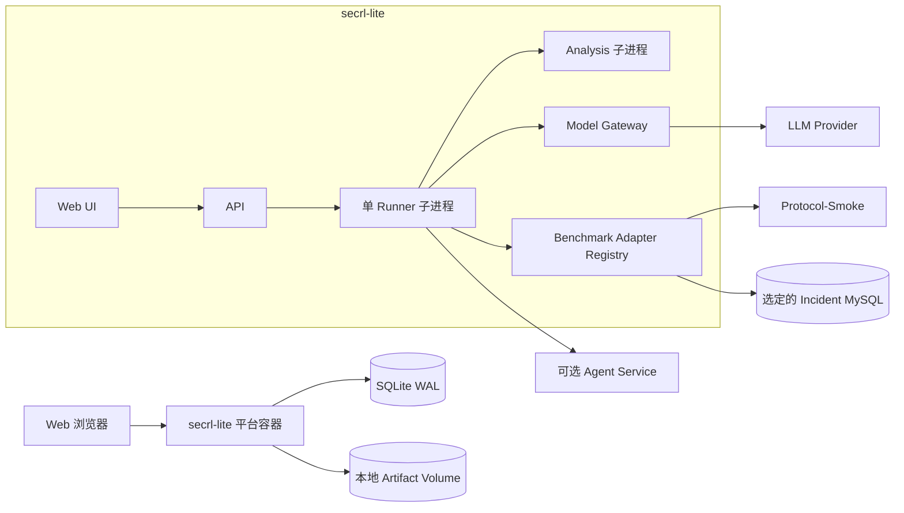
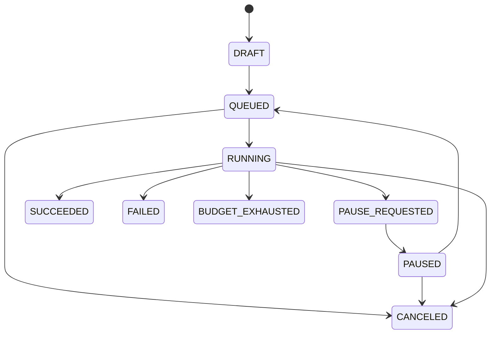

# SecRL / ExCyTIn-Bench Web 测评平台 Lite 设计

**日期：** 2026-08-11

**状态：** 用户已批准，作为第一阶段实施目标

**定位：** 完整平台设计的轻型落地方案，不替代已批准的完整版设计

**完整版设计：** `docs/superpowers/specs/2026-08-10-secrl-web-benchmark-platform-design.md`

## 1. 目标

用尽量少的服务和运维组件，交付一套真正可运行的 Web 测评工具，完成以下闭环：

1. Docker Compose 启动并打开 Web 页面。
2. 配置模型供应商、base URL、model、API Key、temperature、cache seed、上下文和价格。
3. 选择内置 Agent 或符合 Agent Service Protocol v1 的外部 Agent 服务。
4. 选择 Protocol-Smoke 或 SecRL DatasetVersion、Incident 和题目范围。
5. 创建并顺序执行测评任务，支持题目边界暂停、恢复、取消和失败重试。
6. 查看 reward、成功率、题级结果、轨迹、SQL、steps、token、费用和耗时。
7. 调用现有 failure analysis，查看错因候选并完成基础人工复核。
8. 对已完成任务进行模型、Agent、DatasetVersion 和 Incident 维度的结果比较。

Lite 版优先服务于单机、单用户或受信小团队的研究迭代，不作为公网多租户平台，也不承诺高可用和正式公共排行榜治理。

## 2. 与完整版的关系

完整版设计仍是生产化目标和架构决策基线。Lite 版仅改变部署规模和首期功能范围，不改变以下协议：

- Benchmark Adapter Protocol v1。
- Agent Runtime 与 Agent Service Protocol v1。
- Dataset/Case canonical hash。
- Model Gateway 的密钥边界。
- RunSpec、TaskSpec、Action、Observation 和 Artifact manifest 基本格式。
- 自动 Attribution 与 HumanReview 分离的原则。

因此 Lite 版可以逐步迁移到完整版，不需要重写 Agent 或 Benchmark 接口。

## 3. 适用场景

适合：

- 本机或单台实验服务器运行。
- 同一时间执行一个主要测评任务。
- 快速比较模型和 Agent 配置。
- 验证其他 Benchmark Adapter 和外部 Agent Service。
- 团队内部演示、调试和结果分析。

不适合：

- 直接暴露到公网。
- 多组织租户和复杂角色权限。
- 大规模并行 Worker 池。
- 执行任意来源的恶意 Python 插件。
- 高可用、跨主机容灾和正式公共排行榜。
- 需要严格资源计费或合规认证的生产环境。

## 4. 设计原则

1. **一条完整链路优先。** 页面、执行、结果和分析全部可用，而不是只做配置页面。
2. **单执行写入者。** 只有一个 Runner 顺序提交测评结果；API 和 Analysis 仅使用短事务，降低 SQLite 竞争。
3. **协议不缩水。** Benchmark 和 Agent 的交互格式与完整版一致。
4. **环境由平台执行。** Agent 只返回结构化 Action，不直接连接 Benchmark 环境。
5. **文件可验证。** 大对象保存在本地 Artifact Store，并记录 SHA-256。
6. **默认本地安全。** Compose 默认只把 Web 端口发布到宿主 `127.0.0.1`，secret 不回显。
7. **可替换边界。** 数据库、队列、Artifact Store 和认证通过接口封装。

## 5. 最小部署拓扑



### 5.1 Compose 服务

最小启动：

| 服务 | 必需 | 责任 |
|---|---|---|
| `secrl-lite` | 是 | UI、API、单 Runner、Model Gateway、Analysis、SQLite 访问 |
| `incident-*` | 运行 SecRL 时 | Incident MySQL；通过 Compose profile 按需启动 |
| `agent-service-*` | 使用服务型 Agent 时 | 外部 Agent；只返回结构化 Action |

Protocol-Smoke 不需要 MySQL，首次安装可以只启动 `secrl-lite` 完成全链路 smoke run。

SecRL 模式可以：

- 只启动当前要运行的一个 Incident，减少内存和磁盘占用。
- 使用 `secrl-all` profile 一次启动八个 Incident。
- 同一时间只有一个活跃测评任务，因此无需 Redis 和分布式租约。

平台没有 Docker Socket，不会从 Web 动态启动 Incident。操作者在 Compose 启动命令中选择 Incident profile；任务验证阶段检查目标数据库健康状态，未启动时阻止排队并显示所需 profile 名称。

### 5.2 平台容器内部进程

容器入口使用轻量 supervisor 管理：

- Web/API 进程。
- 一个 Runner 子进程。
- 一个可选 Analysis 子进程。

进程之间通过 SQLite task table 和本地信号协作。Runner 崩溃后 supervisor 重启，Runner 根据最后一个完整 Case checkpoint 恢复。

不把长任务直接放入 Web request handler，也不使用内存队列作为唯一任务记录。

## 6. 技术基线

推荐基线：

- Python 3.11。
- FastAPI + Pydantic v2 API。
- SQLAlchemy 2 + Alembic 管理 SQLite schema。
- React + TypeScript + Vite Web UI；构建后的静态资源由平台容器提供。
- SQLite WAL 模式。
- 本地内容寻址 Artifact Store。
- Docker Compose v2。
- Linux 容器，多架构 `linux/amd64` 和 `linux/arm64` 镜像。

Lite 版不引入：

- PostgreSQL。
- Redis。
- Celery/RQ 等独立任务队列。
- S3/MinIO。
- 独立 Scheduler 服务。
- Kubernetes。

## 7. 最小领域模型

Lite 版使用较少的数据表，但保留完整版的 ID 和 revision 语义。

| 表 | 关键内容 |
|---|---|
| `app_setting` | 本地配置、schema version、保留策略 |
| `local_user` | 唯一本地管理员账号、password hash、状态 |
| `secret_ref` | 加密模型密钥、状态、最后验证时间 |
| `model_config_revision` | provider、endpoint、model、参数、价格、hash |
| `benchmark_revision` | Adapter、Tool Schema、Evaluation Protocol 和 hash |
| `dataset_version` | 数据 manifest、split、发布状态和 hash |
| `scenario` | 通用场景；SecRL 中映射 Incident |
| `case_record` | 通用 Case；SecRL 中映射 Question |
| `agent_revision` | built-in 或 service、manifest、参数 schema 和 hash |
| `evaluation_task` | 用户选择、TaskSpec、状态和预算 |
| `run` | Scenario、trial、RunSpec、checkpoint 和状态 |
| `case_attempt` | 单 Case 每次尝试、状态、错误和指标 |
| `artifact` | storage key、kind、SHA-256、大小和引用 |
| `attribution` | 自动错因候选、taxonomy、置信度和 evidence |
| `human_review` | 追加式复核 revision |
| `audit_event` | 关键操作的本地追加记录 |

为简化 SQLite 写入：

- `case_attempt` 同时承担完整版 QuestionResult 和 QuestionAttempt 的最小职责。
- 当前有效 attempt 通过 `run + case + max(attempt_no)` 或显式 `is_final` 获取。
- TrajectoryStep 不拆成独立表，完整轨迹存 artifact，表内只保留摘要 JSON 和索引字段。
- 不建立 LeaderboardSnapshot；比较页面从已完成 Task 读取冻结结果。

## 8. Benchmark 扩展

### 8.1 保留 Benchmark Adapter v1

Lite 版实现与完整版相同的核心方法：

```text
manifest
validate_dataset
import_dataset
enumerate_cases
tool_definitions
prepare_scenario
start_episode
execute_action
evaluate
normalize_metrics
close_episode
release_scenario
```

区别只在运行方式：Lite Adapter 作为平台内置 Python 模块加载，不支持从 Web 上传第三方 Benchmark 代码。

### 8.2 内置 Adapter

MVP Lite 包含：

1. `protocol-smoke`：本地 JSON、`search/read/submit`、确定性 evaluator。
2. `secrl-excytin`：Incident/Question/MySQL/SQL/LLM evaluator 适配。

新增其他 Benchmark 时：

- 编写 Adapter 和 manifest。
- 在源码注册表中登记。
- 通过 Protocol-Smoke 风格的 conformance tests。
- 重新构建平台镜像。

这种方式牺牲了在线安装便利性，但避免 Lite 平台执行未经审查的高权限 Benchmark 代码。

## 9. Agent 扩展

### 9.1 支持类型

Lite 版支持两种 Agent：

- `built-in`：现有 SecRL Agent 通过兼容 adapter 运行。
- `service`：实现 Agent Service Protocol v1 的 HTTP/JSON 服务。

Lite 版不提供 Web 上传 Python wheel。需要增加本地 Python Agent 时，通过源码和镜像构建加入；希望独立开发和跨语言接入时，优先使用 Agent Service。

### 9.2 Agent Service 最小接口

```text
GET  /v1/manifest
GET  /v1/health
POST /v1/sessions
POST /v1/sessions/{session_id}:act
GET  /v1/sessions/{session_id}/usage
POST /v1/sessions/{session_id}:close
```

Lite 版保持完整版安全边界：

- Agent Service 只返回 `tool_call`、`submit` 或协议允许的结构化 Action。
- Worker 校验 Action JSON Schema，再交由 Benchmark Adapter 执行。
- Agent Service 不直接访问 Incident MySQL、gold、Docker Socket 或模型 API Key。
- 模型调用使用短期、限定 Run/Agent/模型/额度的 Model Gateway token。
- `request_id + sequence` 保证 act 重试幂等。
- Agent Service endpoint 只能从服务端配置或管理员页面登记，不能由普通 Task 参数任意填写。

### 9.3 本地服务信任边界

Lite 版假设 Agent Service 来自受信开发者。平台执行以下基本检查：

- manifest 和协议版本。
- endpoint allowlist。
- 请求超时、payload 上限和最大并发。
- 非法 Action 和未知 Tool 拒绝。
- 日志 secret 扫描。

Lite 版不提供 mTLS、强网络沙箱和恶意服务防护，因此默认只允许同一 Compose 网络或明确允许的内网 endpoint。

## 10. 模型与密钥

### 10.1 页面配置

支持：

- provider 类型。
- base URL。
- model/deployment。
- API Key/secret。
- temperature、cache seed。
- context/output token 上限。
- timeout、retry 和 provider concurrency。
- 输入、输出和 cached token 单价。

### 10.2 SecretStore

- API Key 使用部署时提供的 `SECRL_MASTER_KEY` 加密后写入 SQLite。
- 页面只展示掩码、状态和最后验证时间。
- Web API 不提供读取明文接口。
- Runner 只在模型调用期间解密到内存。
- Model Gateway 对日志和错误执行脱敏。

如果主密钥丢失，历史密钥不可恢复，需要用户重新录入。主密钥不能存入仓库、镜像或 artifact volume。

## 11. 任务执行

### 11.1 TaskSpec

创建任务时固化：

- BenchmarkRevision 和 DatasetVersion。
- Scenario/Incident 和 Case/Question 范围。
- ModelConfigRevision。
- AgentRevision 和规范化参数。
- evaluator revision。
- `max_steps`、`max_str_len`、`max_entry_return`。
- trial count、cache、retry、timeout。
- token/cost 预算。

### 11.2 单任务队列

状态：



- 同时最多一个 Task 为 `RUNNING`。
- 后续 Task 保持 `QUEUED`。
- 暂停在当前 Case 完成并提交 artifact 后生效。
- 恢复从下一未完成 Case 开始。
- Worker 丢失时，当前未完成 Case 创建新 attempt。
- 已完成 Case 不重复执行，除非用户明确“重新尝试该题”。

### 11.3 错误处理

- SQL 错误、空结果、错误答案和 step limit 是 Benchmark 结果，不自动平台重试。
- 429、5xx 和短时网络错误按有限退避重试。
- 401、模型不存在和参数不支持立即停止任务。
- Agent Service 超时、协议错误和不可用保留 attempt 后停止或按配置重试。
- Artifact hash/写入失败不能提交成功状态。
- Analysis 失败不改变已完成 Run，可以单独重跑。

## 12. 数据与 Artifact

目录结构：

```text
/data
├── secrl-lite.sqlite3
├── artifacts/
│   └── sha256/ab/cd/FULL_SHA256
├── exports/
├── imports/
└── logs/
```

规则：

- SQLite 使用 WAL、foreign keys 和定期 checkpoint。
- Artifact 先写临时文件，完成 hash 后原子移动到内容寻址路径。
- 数据库只保存 artifact 元数据、摘要和引用。
- 导出包包含 TaskSpec、RunSpec、结果 JSONL、分析输出和 `SHA256SUMS`。
- 默认不自动删除正式标记的运行。
- 探索运行可以按保留天数清理，删除操作进入 audit_event。

备份只需一致性复制 SQLite 快照和 `/data/artifacts`；恢复后运行 manifest 校验。

## 13. 错因分析与复核

直接复用 `experiments/failure_analysis/`：

- identity mapping。
- feature extraction。
- taxonomy_v1 attribution。
- SQL retrieval subtype。
- reporting、human review 和 aggregate。

Lite 平台负责：

1. 将完成 Run 物化为现有工具所需的只读输入。
2. 在 Analysis 子进程中调用版本化 CLI/库。
3. 登记输入、taxonomy、输出和 manifest hash。
4. 将 Attribution 摘要写入 SQLite。
5. 在复核页面追加 HumanReview revision。

Lite 复核功能包含 primary、secondary、confidence、evidence 和 notes；不包含多人分派、复核 SLA、冲突仲裁和复杂审批流。

## 14. 页面

### 14.1 Dashboard

- 当前/排队任务、总体进度和最近完成结果。
- 当前 Incident、Case、steps、token、cost 和错误。
- Model Provider、Agent Service 和 MySQL 健康状态。

### 14.2 Models

- 模型配置、密钥状态、连接测试和价格。
- 创建新 revision，不原地改变历史 Task。

### 14.3 Agents

- 内置 Agent 列表、参数 schema 和版本。
- Agent Service endpoint、manifest、健康和协议版本。

### 14.4 Benchmarks

- Protocol-Smoke 与 SecRL。
- DatasetVersion、Scenario/Incident、Case/Question 和 hash。
- SecRL 数据完整性与 MySQL 健康。

### 14.5 New Evaluation

- 选择 Benchmark、范围、模型、Agent 和参数。
- 配置 steps、截断、trial、重试和预算。
- 显示预计题数和配置摘要后创建任务。

### 14.6 Run Detail

- 状态、进度、暂停/恢复/取消。
- 题级 reward、答案、SQL、steps、token、cost、耗时和错误。
- 按 step 懒加载 trajectory。
- Artifact 和 hash 下载。

### 14.7 Analysis & Review

- taxonomy 候选、primary/secondary、confidence 和 evidence。
- 基础人工复核及修订历史。

### 14.8 Compare

- 选择多个已完成 Task。
- 按模型、Agent、DatasetVersion 和 Incident 比较成功率、平均 reward、token、cost、steps 和耗时。
- 不宣称为正式排行榜，不提供公开名次或跨 Benchmark reward 总榜。

## 15. 安全边界

Lite 默认：

- 容器内服务监听 Compose 网络，Web 端口默认仅发布到宿主 `127.0.0.1`。
- 使用单个本地管理员账号；首次启动通过部署 secret 设置一次性初始化密码，登录后强制修改。
- 不提供公开注册。
- 不允许 Web 上传代码插件或 Benchmark Adapter。
- Agent Service 只允许配置的内网地址。
- App、Agent Service 和 Runner 均无 Docker Socket。
- MySQL 不映射宿主端口，Runner 使用只读账号。
- gold 不发送给 Agent。

如需局域网共享，至少启用 HTTPS 反向代理、强密码和主机防火墙。Lite 不应直接面向公网；公网部署应迁移到完整版的认证、RBAC、PostgreSQL、Redis、强隔离和审计设计。

## 16. 跨平台

| 平台 | Lite 支持 |
|---|---|
| Ubuntu/Linux `amd64` | 完整支持 |
| Ubuntu/Linux `arm64` | 完整支持 |
| macOS Intel/Apple Silicon | Docker Desktop 本地运行 |
| Windows x86_64 | Docker Desktop + WSL2 本地运行 |

macOS/Windows 主要用于开发和小规模实验。正式耗时比较仍应在同一 Linux ExecutionProfile 下进行。

## 17. Lite 版明确暂缓的能力

| 能力 | Lite 处理 | 完整版处理 |
|---|---|---|
| 用户与组织 | 单本地管理员 | 多用户、组织、RBAC、OIDC |
| 队列 | SQLite 单 Runner | Redis、多 Worker、Scheduler |
| 并发 | 一个活跃 Task | 3–8 个跨 Incident Run |
| 数据库 | SQLite | PostgreSQL |
| Artifact | 本地 volume | 本地或 S3 兼容存储 |
| Agent 插件 | 内置或外部服务 | wheel 上传、审批、隔离环境 |
| Benchmark 插件 | 源码内置 | 受控发布与更强环境隔离 |
| 排行榜 | 私有 Compare 页面 | 正式资格、排名规则、快照 |
| 审计 | 本地追加事件和 hash | 完整审计链、签名 manifest |
| 复核 | 单人基础复核 | 队列、权限、完整历史治理 |
| 高可用 | 无 | 备份、远程 Worker、HA/DR |
| 公网 | 不支持 | WAF、MFA、租户隔离、配额 |

## 18. 升级到完整版

Lite 开发时必须通过接口隔离四个可替换组件：

| Lite | 完整版 |
|---|---|
| `SQLiteRepository` | `PostgresRepository` |
| `SQLiteTaskQueue` | `RedisTaskQueue` |
| `LocalArtifactStore` | `S3ArtifactStore` |
| `LocalAuthProvider` | `Password/OIDC AuthProvider` |

迁移步骤：

1. 保持 Benchmark Adapter、Agent Service、TaskSpec 和 RunSpec 不变。
2. 运行 SQLite 到 PostgreSQL 的一次性数据迁移。
3. 将 Runner 从 supervisor 子进程拆为 Compose Worker。
4. 将任务领取切换到 Redis 和 Scheduler 租约。
5. 将 artifact 复制到对象存储并验证原 SHA-256。
6. 启用组织、RBAC、OIDC 和正式审计链。
7. 对满足完整性规则的历史 Run 重新做正式资格判断；不自动把 Lite Compare 结果提升为正式排行榜记录。

## 19. 实施阶段与估算

### 19.1 阶段一：协议与本地骨架，1 周

- SQLite schema 和 migration。
- Artifact Store。
- Benchmark Adapter v1、Agent Runtime v1 数据结构。
- Protocol-Smoke Adapter 和确定性测试 Agent。
- 最小 API 与 UI shell。

### 19.2 阶段二：运行闭环，1–2 周

- ModelConfig、SecretStore 和 Model Gateway。
- 单 Runner、状态机、checkpoint 和预算。
- Agent Service v1 client/registry。
- Protocol-Smoke 完整任务。

### 19.3 阶段三：SecRL 接入，1–2 周

- SecRL Adapter。
- Incident Compose profile 和只读 MySQL。
- 现有 Agent 兼容 adapter。
- reward、trajectory、SQL、token 和 cost。

### 19.4 阶段四：分析、页面与打包，1–2 周

- failure analysis、复核和 Compare。
- 导入导出与 hash 校验。
- macOS、Windows、Linux smoke test。
- 安装、备份和恢复文档。

总体估算：

- 2 名熟悉仓库的工程师：4–6 周，约 8–12 人周。
- 1 名资深全栈工程师：7–10 周。
- 如果只做 Protocol-Smoke、不接 SecRL，约 2–3 周，但不能视为 SecRL 平台闭环。

## 20. 验收标准

### 20.1 安装

- 在干净 Ubuntu `amd64` 或 `arm64` 主机运行一条 Compose 启动命令后可以打开页面。
- 未准备 Incident 数据时，Protocol-Smoke 仍可完成全链路运行。
- 配置数据、SQLite 和 artifact 位于持久 volume。

### 20.2 执行

- 可创建 Protocol-Smoke 和 SecRL 任务。
- 可运行至少一个内置 Agent 和一个参考 Agent Service。
- Agent Service 不能直接调用 Benchmark Tool 或获取 API Key。
- 任务可在 Case 边界暂停、恢复和取消。
- Runner 被终止后可从最后完整 Case 恢复。

### 20.3 结果

- 页面展示 reward、success、steps、token、cost、耗时和 Benchmark 指标。
- SecRL 展示 SQL 成功/失败及完整 trajectory artifact。
- failure analysis 输出与输入、taxonomy 和制品 hash 可对应。
- HumanReview 修改不覆盖自动 Attribution。
- Compare 页面不混排不同 Benchmark 的 reward。

### 20.4 完整性与安全

- Dataset、Case、RunSpec 和 artifact 都有 SHA-256。
- API Key 不出现在 API response、日志或 artifact。
- gold 不进入 Agent Session 和 Observation。
- SQLite 备份加 Artifact 目录可以恢复可查询的历史 Run。

## 21. 风险

| 风险 | 等级 | 缓解 |
|---|---|---|
| 单容器故障影响 Web 和 Runner | 中 | Runner 子进程、持久 checkpoint、supervisor 重启 |
| SQLite 长事务阻塞页面 | 中 | 单写入者、WAL、小事务、轨迹放 artifact |
| Artifact 占满磁盘 | 中 | 用量显示、保留策略、导出后清理 |
| Lite 被误用于公网 | 高 | 默认 localhost、明显部署警告、无公网支持声明 |
| Agent Service 越权 | 高 | 平台执行工具、endpoint allowlist、短期 token、无 DB 网络 |
| 新旧 SecRL 行为不一致 | 高 | 冻结权威基线、现有结果回归、Adapter contract tests |
| 单任务吞吐不足 | 低 | 符合 Lite 定位；升级到完整版 Worker/Redis |
| SQLite 到 PostgreSQL 迁移成本 | 中 | Repository 接口、稳定 ID、迁移测试和 artifact 不入库 |

## 22. 实施前置条件

在编写 Lite 平台代码前仍需完成：

1. 冻结本地与远端 SecRL 权威代码基线。
2. 确认无截断改动中应纳入的参数和错误修复。
3. 生成首个 SecRL DatasetVersion manifest。
4. 冻结 Benchmark Adapter v1 和 Agent Service Protocol v1 schema。
5. 选择用于回归的现有 Run 和 failure analysis 输出。
6. 固定 Python 3.11 和多架构基础镜像。

## 23. 最终建议

Lite 版适合作为第一条可运行产品链路：组件少、故障面小，能较快把现有科研 CLI 转成可使用的 Web 工具，同时真实验证 Benchmark 和 Agent 的扩展协议。

当出现以下任一信号时，应迁移到完整版，而不是继续扩张 Lite：

- 需要两个以上任务并发。
- 需要多人权限和私有结果隔离。
- 需要公开或正式排行榜。
- 需要远程 Worker、对象存储或高可用。
- 需要上传第三方代码插件。
- 需要面向公网。
